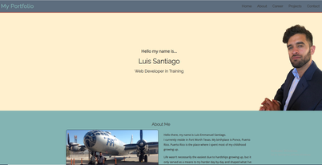
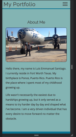
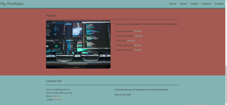

# Port-de-Luigi-2.0

## Description
This project is a personal portfolio page for SMU Coding Bootcamp.

 

## Usage

1. You are able to navigate through the webpage by simply clicking the navigation bar menu. 

2. At smaller screen sizes, the navigation menu turns into a hamburger menu tab that activates a drop down on click showing the options from the previous menu.

        

3. At the bottom of the page, it supplies the spectator a link of my projects so far as well as my contact information.

### Link
If you would like to try it using this [link, ](https://wingz003.github.io/Port-de-Luigi-2.0/) you will get to know a little more about me and what i can do. 

Thank you very much!
